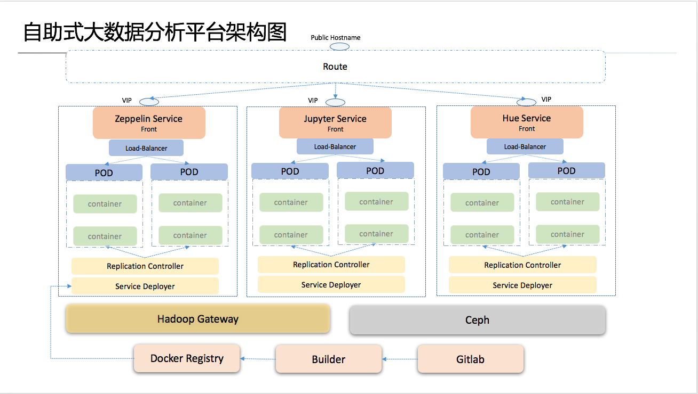

# 背景
- 集团各部门大量数据分析/BI, 需要一个分析平台，避免重复采购和资源浪费
- 缺乏业界最新的大数据分析工具，满足数据科学家和建模人员的需求
- 无法保证SLA，部署和扩容费时繁琐，工具间资源没有隔离，用户体验较差
# 功能
- 统一的大数据分析、建模、机器学习的平台入口
- 后续可根据业务部门需求综合评估并引入新的工具
- 自动部署Zeppelin、 RStudio、Hue、 Jupyter、 Tableau，Tensorflow等工具
- 权限管理的增强、多用户代码共享和资源/权限隔离
# 优点
- 专门团队负责保证7*24 小时服务和SLA，统一监控、自动容错
- 大幅提高数据工程师和数据科学家的工作效率
- 统一调度大数据分析和GPU集群资源，分析工具快速部署、上线和扩缩容

# 架构

